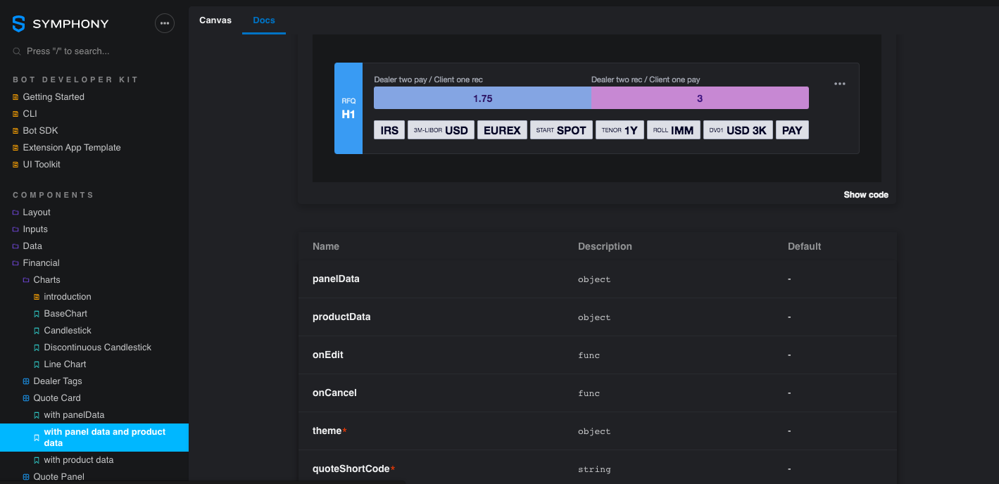

# My test page

This is a very first page.



## What about a title

Let's try some sample code



```javascript
var i=0;
var f = (p) => {
    // put your code here
}
```







```java
String s="Hello develop change";
@get
getUser() = {
    // something here
}
```



Let's try an API



user



Test method to get users

















```text

```





